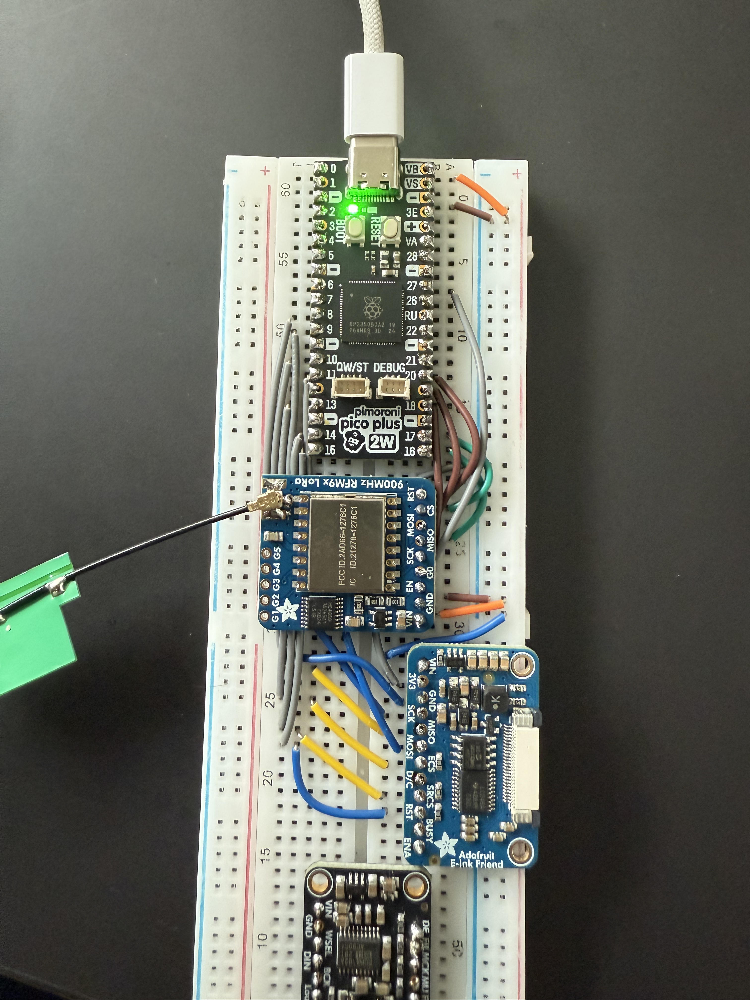
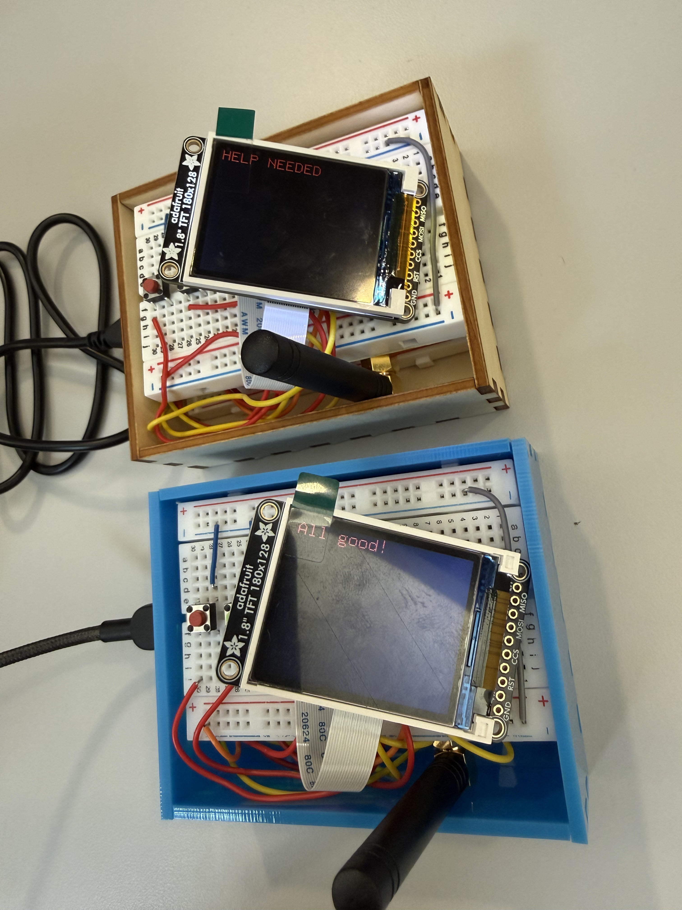

## Prelude

REDO???? This semester at Georgia Tech I took [CS4605: Mobile and Ubiquitous Computing](https://oscar.gatech.edu/bprod/bwckctlg.p_disp_course_detail?cat_term_in=202408&subj_code_in=CS&crse_numb_in=4605) as part of the Devices thread of my CS major. It's all about what it takes to create mobile and ubiquitous computing applications. Y'know stuff like sensors, machine learning, context-awareness, all that good stuff. Anyways, the main part of the class is to  split into teams of 4 or 5 and either participate in ongoing research, or do your own research project. I took the class with two of my friends with the intention of pursuing our own project.

## The Birth of LEWOC

All three of us went into this class knowing we wanted to do some kind of embedded application for our project. I've been interested in [LoRa](https://en.wikipedia.org/wiki/LoRa) since I first heard about it about 4 years ago, and my team was interested too, so we set about find an application for it. I forget how exactly we got there, but we decided to leverage LoRa's long-range capabilities to enable text communication in remote areas. We decided to name this project **LoRa Enabled Wearable Off-grid Communication**, or LEWOC (lee-wock) for short. At the start, we wanted the end result to have:

- Pendant form-factor
- Hardware controls for texting
- Battery power
- Display text messages
- 1 mile (1.6 kilometers) of range
- Rust firmware

We ended up reaching some of these, abandoning others, and completely changing some.

## Hardware and Software

On our team, I had the most embedded experience so I had the important job of choosing our hardware and software stack. We only had about 10 weeks for this project, so if we picked the wrong stack, it might've all been over from the start.

### Hardware

First off, the hardware we chose for the microcontroller, LoRa radio, and display:

#### Microcontroller

Shortly before beginning this project I experimented with the [**RP**2350](https://www.raspberrypi.com/products/rp2350/) on the [Pico 2W](https://www.adafruit.com/product/6087) development board to [make an e-ink bike tag](https://github.com/tsar-boomba/caltrain-bike-tag) for use on [Caltrain](https://en.wikipedia.org/wiki/Caltrain) (those who know will get it). I really enjoyed my experience working with it, so I decided we'd use the same setup, **RP**2350 on Pico 2W, for LEWOC. It has good Rust support from the community and all the IO you could ever wish for thanks to its [Programmable IO](https://magazine.raspberrypi.com/articles/what-is-programmable-i-o-on-raspberry-pi-pico) that can be used to "emulate" many other peripherals.

#### LoRa Radio

For our radio, we went with the [Adafruit RFM95W LoRa Radio Transceiver Breakout](https://www.adafruit.com/product/3072) board mostly due to how accesible it was and ease of prototyping. It actually wasn't that easy to prototype with because I had to solder [an antenna connector](https://www.adafruit.com/product/1865) onto two boards, which was a little annoying. The board uses [Semtech's SX1276 Modem](https://www.semtech.com/products/wireless-rf/lora-connect/sx1276), which has all a nice SPI interface and all the features we need for this project.

#### Display

The display is one I used before in my [spotify status display project](https://github.com/tsar-boomba/esp-display) from last year, the [1.8" Color TFT LCD ST7735R](https://www.adafruit.com/product/358) from Adafruit. Its just the right size, color, and has community-made Rust drivers. What more could you ask for?

### Software

On the software side, I immediately knew we were going to use [Rust](https://rustlang.org). Mostly because I really like it, but also because there was already amazing community support for the chosen hardware. Outside of my personal bias towards it, Rust is a great choice for hobby stuff because of how easy it is to use community maintained Hardware Abstraction Layers (HALs), drivers, and general purpose libraries.

Of the many libraries and frameworks for embedded development, I chose [Embassy](https://github.com/embassy-rs/embassy) for this project because it has great support for the **RP**2350 and I love how it embraces async Rust for handling concurrent tasks. The Embassy project also maintains drivers for [bluetooth](https://github.com/embassy-rs/trouble) and [LoRa](https://github.com/lora-rs/lora-rs) radios which we need for this project.

Choosing Embassy and Rust was hands down the most important technical choice for this project. It was just so easy to write correct concurrent code, and enabled us to implement many features which would be deemed complex or hurt performance in simpler software frameworks (arduino).

## Step 1: Setting Up lora-rs

The first goal we had was to set up communication between two LoRa radios since if we couldn't at least do that, then the whole project was cooked. Lucky for us, the lora-rs project has some [examples using Embassy on an **RP**2040](https://github.com/lora-rs/lora-rs/tree/main/examples/rp/src/bin) which were easy enough to adapt to my project and get a quick loop which would receive with a timeout then send out a packet.

<figure>

<figcaption>Sep 25, 2025: The initial prototype.</figcaption>
</figure>

As all experienced programmers know, writing the code is the easy part, especially when working close to the hardware where you have to check datasheets and read errata. Writing code that works properly is a whole 'nother story, even when using Rust which prevents a lot of bugs at compile time. Well, needless to say, it didn't work.

## The _Only_ Bug

Let me just start this section out by praising Rust and Embassy. I think it speaks volumes to the merits of Rust as a tool and a community that throughout the whole project, this is the only bug that was more than a little "oopsie daisy" fixed on the next flash. This bug was a toughie, let me just say that. One I won't soon forget.

So I had the basic code that should send and receive a string between two radios, but the issue was that it would hang on trying to receive. The timeout would never occur. The first thing I did was double check my wiring, and everything there seemed ok. After that, I tried changing the configuration of the receive thinking I'd made the timeout too long. That didn't help. After exhausting my own expertise (there wasn't much to exhaust), I went to the issue tracker for lora-rs to see if anyone else had encountered something like this.

After looking through the issues for a while, I came across [someone having the same issue with lorawan](https://github.com/lora-rs/lora-rs/issues/312). In the replies, it was illuminated to me that the RxTimeout interrupt was only raised on the `dio1` pin of the Sx1276. The API exposed by lora-rs for Sx127x family modems only allowed using the `dio0` pin for interrupt signalling. So whenever I tried to receive with a timeout, once the timeout occurred, the modem would pull `dio1` high to signal to the microcontroller that the timeout ocurred, but since I wasn't waiting for that, it would end up waiting forever.

To fix this, I [forked lora-rs to add support for the `dio1` pin](https://github.com/tsar-boomba/lora-rs/commit/c69f46c315ca46b3c9546be3d578a2e28d1ca84e) and started using it in our project through a git dependency. I plan on upstreaming this improvement soon. With this in place, we had reached the first major milestone of the project, communication between two devices!

<video src="/post-assets/lewoc/first-comms.mp4" controls></video>
<p class="caption">Sep 26, 2025: The first successful communication between two devices.</p>

## Protocol and Encryption

Now that we can send a string between the two devices, we need to properly define the protocol they will use to communicate. LoRa is a peer-to-peer protocol, so every device on the channel is able to receive sent messages. If we send plaintext messages, then anyone can easily receive them and steal potentially sensitive information. So, we want to be able to encrypt messages. Asymmetric encryption is out of the question for this due to its complexity, so symmetric encryption is definitely the way to go for us.

I started by figuring out how to get the symmetric encryption keys onto the devices. Obviously I could've just hardcoded the keys into the binary, but that's super lazy, so I wanted to do something different. I wanted to _think different_ (not _that_ different though). The plan was to use the onboard flash to permanently store the encryption key on each device and allow dynamic configuration over bluetooth. This was pretty easy to achieve thanks to the great [`sequential-storage` crate](https://github.com/tweedegolf/sequential-storage) maintained by the great people at [Tweede Golf](https://tweedegolf.nl/en) (they write amazing blog posts btw).

With the encryption keys successfully on device, now I needed to choose a encryption algorithm. I went with the [ascon](https://en.wikipedia.org/wiki/Ascon_(cipher)) cipher because its optimized for resource constrained devices and has good support from the Rust community in the `ascon-aead` crate. This actually my first time dealing with symmetric encryption at this low of a level, so it took me a while to figure everything out for the encryption and protocol. Here's what I came up with.

Say the program wants to send a string of 64 bytes. It will first generate a random [nonce (initialization vector)](https://en.wikipedia.org/wiki/Cryptographic_nonce) and use that to encrypt the plaintext. This will also generate a 16-byte tag that can verify that the packet wasn't tampered with. We then construct a packet as such:

1. 4-byte magic number for quick identification of packets
2. n-byte encrypted ciphertext
3. 16-byte tag
4. 16-byte nonce

Considering the max packet size of 222-bytes with out modulation parameters, this structure allows for 186 bytes of encrypted data per message. More than enough for our use-case.

On the receiving side, the program first checks that the first 4 bytes of the packet match the specified magic number before anything else. From there, it will split out the ciphertext, nonce, and tag from the packet. With these, it then unencrypts the ciphertext in-place using the encryption key, tag, and nonce.

All in all, super happy to have encryption working, and I learned a lot implementing this.

## Display Integration and Input

I didn't work on this alone, it was a team effort, and this is where my team's contributions come in. Two of my team members worked together to get the display working using my [Spotify display project](https://github.com/tsar-boomba/esp-display) as a basis for the code. The [`embedded-graphics` suite of crates](https://github.com/embedded-graphics) were huge for this part of the project. Especially useful was [the simulator](https://github.com/embedded-graphics/simulator) which allowed us to do the bulk of UI development on our host machines instead of tinkering with it on-device.

These team members also added two buttons for sending preset "all good" and "help" messages directly from the device. They're not super experienced with Rust, and especially not async Rust, so their implementation worked, but was kinda inefficient since it used polling.

## Mobile App

We don't have a keyboard or any kind of typing interface on the device, so we wanted to create a mobile app and bluetooth to send longer, typed out, messages. This part was done by our fourth team member using React Native. It scans for our custom service UUID and connects to the device. From there it writes to a characteristic to send over the typed message to be sent over LoRa. The app worked great in our testing but actually pooped out during our final demo in class :P so that kinda sucked. Despite that, it was a great addition to the project and really brought everything together.

As an aside, we actually faced a really strange issue with writing to the message characteristic. Seemingly randomly, the second byte written would be 1 lower than what we actually typed and wrote from the client. We ended up working around it with following:

```rust
if event.handle() == message_characteristic.handle {
	let mut value = event.value(message_characteristic).unwrap();
	if value.len() >= 2 {
		// For some god forsaken reason the second byte
		// of the write payload is always 1 less than
		// was actually sent by the client/central.
		// So we correct it here before sending it off to the LoRa task.
		// 😭😭😭😭😭😭😭😭
		unsafe { value.as_bytes_mut()[1] += 1 }
	}

	log::info!("[gatt] Write to Characteristic: {value}");
	msg_signal.signal(value);
}
```

My guess is that this has to do with the firmware for the bluetooth modem, but I've no clue really. If anyone reading this has any idea what could've caused this, please reach out to me on [Bluesky](https://bsky.app/profile/igamble.dev) or [Linkedin](https://linkedin.com/in/igamble).

## Firmware Finishing Touches

With all of our core features implemented, I did a few finishing touches to tie the firmware together. First, I moved all the display code to the second core since `embedded-graphics` and our driver are blocking. It's actually amazing how easy it was to start using the second core, it literally worked perfectly on the first flash. Next, I refactored the inputs to run in their own task and use [a signal](https://docs.embassy.dev/embassy-sync/git/default/signal/struct.Signal.html) to let the LoRa task know when to send out a preset message.

## Presentation

With these touches, the firmware was pretty much done and we just needed to make everything presentable and collect some stats.

### Enclosure

We didn't want to just walk into our final presentation with a couple of breadboards, so we decided to laser cut some enclosures for the prototypes at [The Hive Makerspace](https://hive.ece.gatech.edu/). Big props to [Boxes.py](https://boxes.hackerspace-bamberg.de/boxes.py) for making the stencil we used!

<figure>

<figcaption>Nov 24, 2025: Our prototype enclosures. Comprised of two stacked breadboards with the microcontroller and modem on the lower board.</figcaption>
</figure>

### Range Testing

Our original goal with this was to achieve 1 mile (1.61 km) of range on Georgia Tech's campus. On November 24, 2025 we went out and test it. We ended up achieving a range of...  1000 feet! Not quite our goal, but considering the antenna we were using, it was pretty much in line with its capabilities. Improving this would require a much larger antenna which we didn't really wanna do since our presentation was just a week away.

## The Demo

With all of that said and done, here's a demo video filmed as a backup for our final presentation:

<video src="/post-assets/lewoc/demo.mp4" controls></video>
<p class="caption">Nov 24, 2025: Final demo of all LEWOC capabilities.</p>

## Reflection

This project was just so frickin fun. A semester of working with my friends, introducing them to Rust, and building something really cool. What more could anyone ask for? All code is available in [the lewoc GitHub repo](https://github.com/tsar-boomba/lewoc). It isn't really that great, but could be a decent resource for anyone interested in Embassy, lora-rs, or Rust. Thanks for reading! Reach out on [Bluesky](https://bsky.app/profile/igamble.dev) or [Mastodon](https://mastodon.social/@igamble) if you have any questions!
